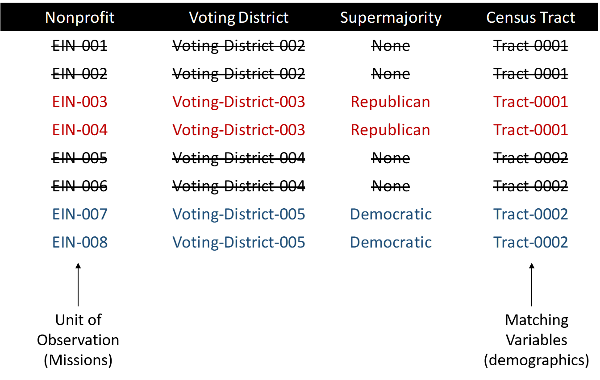

# Data Sources

2008 Presidential Election Data from Texas: [ [Harvard Election Data Archive](https://projects.iq.harvard.edu/eda/home) ]   
ACS 2010 at Tract Level: [ [US Census](https://www.census.gov/programs-surveys/acs/guidance/comparing-acs-data/2010.html) ]  
Voting District to Census Tract Crosswalk: [ [Missouri Census Data Center](http://mcdc.missouri.edu/applications/geocorr2014.html) ]  
2010 Nonprofit Firms and Locations: [ [NCCS Core Files](https://nccs-data.urban.org/index.php) ]  


# Sample Framework

The goal of the study is to build a sample framework whereby we can compare nonprofits from super-majority voting districts in order to determine how nonprofit missions vary by the political ideology of the communities in which they are located. 

Since democratic and republican super-majority voting districts typically look very different (suburban and white versus urban and diverse), we must first match them based upon demographics in order to create balanced voting districts (similar poverty rates, percentage minorities, and population density in each) that differ primarily on political ideology.

The replication files here explain the process of linking voting data to census data, finding voting districts that are very similar demographically be very different in voting patterns, and then locating nonprofits within those districts to analyze differences in mission. 


<div class="figure">

<p class="caption">Relationship between the three data sources in our research database.</p>
</div>


TRACT represents Census tracts that contain geographic data about the population. Voting districts are the geographic units of aggregation for voting data within states. These two datasets need to be merged in order to have both demographic and voting data. 

The nonprofit firm database comes from tax records that have been compiled by the Urban Institute (NCCS Core files). The unit of analysis of the study is nonprofit missions. We filter voting districts to eliminate those that are not supermajority districts, then further eliminate voting districts that cannot be matched to doppelgangers (for each republican supermajority district, find one democratic supermajority district that is a demographic "twin"). The add nonprofits in those districts to the sample. Repeat for all that can be reasonably matched. 

<br>
<br>


<div class="figure">

<p class="caption">Dataset after all merges are complete, prior to matching.</p>
</div>


<br>
<br>


## Sampling Framework

We followed steps are reported in *Appendix A* of the paper. They show the process for arriving at the 125 nonprofit mission statements that are coded for the paper.

8,400 total voting districts in Texas

* 1,451 Democratic supermajority districts  
* 2,886 Republican supermajority districts  

3,513 census tracts in Texas

* 1,305 voting districts have IDs that can be matched to census tracts  
* 216 Democratic supermajority districts remained  
* 464 Republican supermajority districts remained  

Of the 680 super-majority voting districts that can be linked to census data, the matching procedure generated 102 districts in the balanced sample:

* 51 Democratic supermajority districts
* 51 Republican supermajority districts

Of the 22,295 nonprofits in the state, 323 are located in the matched supermajority districts and were used for analysis of NTEE codes and comparison of revenue and nonprofit age.

* 158 nonprofits from Democratic supermajority districts  
* 165 nonprofits from Republican supermajority districts  

Of these 323 nonprofits located in the matched voting districts, we were able to find mission statements listed on websites for 125. 

* 74 nonprofits from Democratic supermajority districts  
* 51 nonprofits from Republican supermajority districts  


**UPDATES**

In the process of putting together replication files we discovered one minor error in reporting the sample framework: 

*Appendix A* reports 3,513 census tracts in Texas in 2010.

There are actually 5,265 census tracts in Texas 2010, but only 3,513 in the voter-district-census-tract crosswalk obtained through the Missouri Census Data Center (see below).

We were also able to fix more voter district IDs to increase the merge rate in these replication examples. Compared to *Appendix A* in the paper (reported above) we now have: 

* 3,496 voting districts have IDs that can be matched to census tracts  
* 738 Democratic supermajority districts remained  
* 900 Republican supermajority districts remained 

In total that equals 1,638 supermajority voting districts that can be linked to primary census tracts, more than the 680 super-majority voting districts reported in *Appendix A* originally. 

These things do not change the results of the study since the results represent a comparison of 102 nonprofits from matched and demographically balanced voting districts (51 republican and 51 democratic districts). So even though the matched sample was smaller, it still retains the properties that are important for achieving high internal validity with propensity score matching - only comparing the "twins" in the data instead of the full sample.

The updates are included here for anyone that wants to extend the study. 


# R Packages


```r
install.packages( "rgdal" )
install.packages( "acs" )
install.packages( "censusapi" )
install.packages( "rgenoud" )
install.packages( "dplyr" )
install.packages( "stargazer" )
```


```r
library( rgdal )      # read GIS shapefiles
library( acs )        # get data from census
library( censusapi )  # get data from census
library( rgenoud )    # optimization
library( dplyr )      # data wrangling
library( stargazer )  # pretty tables
```


# Gathering Census Data

This example uses the **acs** package in R to download 2010 American Community Survey data from the US Census. 

You can find codes for variable names at the Census API site:

<https://api.census.gov/data/2010/acs/acs5/variables.html>


You will need to get a free Census API key: <https://api.census.gov/data/key_signup.html>


```r
api.key.install( key="your_key_here" )

my.censuskey <- "your_key_here"
```


**NOTE**: The original study uses the **acs** package but I would highly recommend using Hannah Recht's **censusapi** package. It is much easier to use!

For details on poverty measures see:

https://www.socialexplorer.com/data/ACS2013_5yr/metadata/?ds=ACS13_5yr&table=B17001


```r
census <- getCensus( name="acs/acs5", 
                       vintage=2010, 
                       key=my.censuskey, 
                       vars=c( "NAME", 
                               "B01002A_001E",  # median age
                               "B19013_001E",   # median household income
                               "B01003_001E",   # total population"B01003_001"
                               "B17001_002E",   # poverty
                               "B17001_001E",   # population used for pov
                               "B03003_003E",   # hispanic
                               "B02001_002E",   # race.white
                               "B02001_003E"),  # race.black
                       region="tract:*", 
                       regionin="state:48")     # texas

names( census )
```

```
##  [1] "state"        "county"       "tract"        "NAME"        
##  [5] "B01002A_001E" "B19013_001E"  "B01003_001E"  "B17001_002E" 
##  [9] "B17001_001E"  "B03003_003E"  "B02001_002E"  "B02001_003E"
```

```r
census$geoid <- paste0( census$state, census$county, census$tract )

names( census ) <- c("state","county","tract","NAME",
                     "medianage","income",
                     "totalpop","poverty","povbase",
                     "hispanic","white","black",
                     "geoid")

# Remove missing values
census$income[ census$income == -666666666 ] <- NA
census$medianage[ census$medianage == -666666666 ] <- NA

# Delete zero population cases so rates are finite
census$totalpop[ census$totalpop == 0 ] <- NA
census$povbase[ census$povbase == 0 ] <- NA

census <- 
  census %>%
  mutate( poverty = round( 100*(poverty/povbase), 2),
          hispanic = round( 100*(hispanic/totalpop), 2),
          white = round( 100*(white/totalpop), 2),
          black = round( 100*(black/totalpop), 2) )

census <- select( census, - povbase ) # drop extra pop variable   

head( census )
```

<div data-pagedtable="false">
  <script data-pagedtable-source type="application/json">
{"columns":[{"label":[""],"name":["_rn_"],"type":[""],"align":["left"]},{"label":["state"],"name":[1],"type":["chr"],"align":["left"]},{"label":["county"],"name":[2],"type":["chr"],"align":["left"]},{"label":["tract"],"name":[3],"type":["chr"],"align":["left"]},{"label":["NAME"],"name":[4],"type":["chr"],"align":["left"]},{"label":["medianage"],"name":[5],"type":["dbl"],"align":["right"]},{"label":["income"],"name":[6],"type":["dbl"],"align":["right"]},{"label":["totalpop"],"name":[7],"type":["dbl"],"align":["right"]},{"label":["poverty"],"name":[8],"type":["dbl"],"align":["right"]},{"label":["hispanic"],"name":[9],"type":["dbl"],"align":["right"]},{"label":["white"],"name":[10],"type":["dbl"],"align":["right"]},{"label":["black"],"name":[11],"type":["dbl"],"align":["right"]},{"label":["geoid"],"name":[12],"type":["chr"],"align":["left"]}],"data":[{"1":"48","2":"001","3":"950100","4":"Census Tract 9501, Anderson County, Texas","5":"41.1","6":"46027","7":"5216","8":"9.93","9":"2.65","10":"86.29","11":"12.33","12":"48001950100","_rn_":"1"},{"1":"48","2":"001","3":"950401","4":"Census Tract 9504.01, Anderson County, Texas","5":"36.1","6":"61442","7":"8089","8":"0.00","9":"25.94","10":"55.30","11":"42.22","12":"48001950401","_rn_":"2"},{"1":"48","2":"001","3":"950402","4":"Census Tract 9504.02, Anderson County, Texas","5":"42.5","6":"61538","7":"3755","8":"0.00","9":"17.23","10":"43.12","11":"48.81","12":"48001950402","_rn_":"3"},{"1":"48","2":"001","3":"950500","4":"Census Tract 9505, Anderson County, Texas","5":"43.0","6":"32529","7":"4576","8":"22.57","9":"31.97","10":"63.09","11":"27.51","12":"48001950500","_rn_":"4"},{"1":"48","2":"001","3":"950600","4":"Census Tract 9506, Anderson County, Texas","5":"33.0","6":"40409","7":"6114","8":"17.43","9":"25.11","10":"68.40","11":"19.53","12":"48001950600","_rn_":"5"},{"1":"48","2":"001","3":"950700","4":"Census Tract 9507, Anderson County, Texas","5":"34.3","6":"30245","7":"3266","8":"37.44","9":"22.93","10":"45.62","11":"42.47","12":"48001950700","_rn_":"6"}],"options":{"columns":{"min":{},"max":[10]},"rows":{"min":[10],"max":[10]},"pages":{}}}
  </script>
</div>


```r
census %>%
  select( medianage, income, totalpop, poverty,
          hispanic, white, black ) %>% 
          stargazer( type = "html", digits=0 )
```


<table style="text-align:center"><tr><td colspan="8" style="border-bottom: 1px solid black"></td></tr><tr><td style="text-align:left">Statistic</td><td>N</td><td>Mean</td><td>St. Dev.</td><td>Min</td><td>Pctl(25)</td><td>Pctl(75)</td><td>Max</td></tr>
<tr><td colspan="8" style="border-bottom: 1px solid black"></td></tr><tr><td style="text-align:left">medianage</td><td>5,215</td><td>36</td><td>8</td><td>11</td><td>30</td><td>42</td><td>80</td></tr>
<tr><td style="text-align:left">income</td><td>5,209</td><td>52,713</td><td>28,259</td><td>6,140</td><td>33,831</td><td>63,284</td><td>250,001</td></tr>
<tr><td style="text-align:left">totalpop</td><td>5,224</td><td>4,654</td><td>2,241</td><td>24</td><td>3,100</td><td>5,826</td><td>25,073</td></tr>
<tr><td style="text-align:left">poverty</td><td>5,215</td><td>18</td><td>13</td><td>0</td><td>7</td><td>25</td><td>100</td></tr>
<tr><td style="text-align:left">hispanic</td><td>5,224</td><td>36</td><td>28</td><td>0</td><td>13</td><td>54</td><td>100</td></tr>
<tr><td style="text-align:left">white</td><td>5,224</td><td>72</td><td>20</td><td>0</td><td>63</td><td>87</td><td>100</td></tr>
<tr><td style="text-align:left">black</td><td>5,224</td><td>12</td><td>17</td><td>0</td><td>1</td><td>15</td><td>100</td></tr>
<tr><td colspan="8" style="border-bottom: 1px solid black"></td></tr></table>


Capture the study data in case the API changes:


```r
write.csv( census, "TexasCensusTractData2010.csv", row.names=F )
```


# Voting Districts Crosswalk

Voting districts and census tracts do not all share contiguous boundaries, so merging voting data and census data can be tricky. The Missouri Census Data Center has created tools that maps voting districts to census tracts using geographic apportionment. You can visit the MABLE Geocorr14 Geographic Correspondence Engine here:

<http://mcdc.missouri.edu/websas/geocorr14.html>

A correspondence table has been created by selecting the 2010 Census Tracts and Voting Tabulation Districts and is saved as the file "crosswalk.csv".

Note, the variable **pop10** comes from the crosswalk and refers to **voting district population**. The variable **totalpop** comes from the 2010 Census ACS and refers to the **census tract population**.


Since the relationships are not nested it will not be a one-to-one relationship, i.e. one voting district can match to multiple census tracts. As a result, we select the census tract for each voting district that has the highest apportionment rate (geographical overlap). 

The mean apportionment rate is 89% (standard deviation of 17%), with a median of 100% overlap. 


```r
crosswalk <- read.csv( "crosswalk.csv", colClasses="character" )

head( crosswalk )
```

<div data-pagedtable="false">
  <script data-pagedtable-source type="application/json">
{"columns":[{"label":[""],"name":["_rn_"],"type":[""],"align":["left"]},{"label":["county"],"name":[1],"type":["chr"],"align":["left"]},{"label":["vtd"],"name":[2],"type":["chr"],"align":["left"]},{"label":["tract"],"name":[3],"type":["chr"],"align":["left"]},{"label":["cntyname"],"name":[4],"type":["chr"],"align":["left"]},{"label":["vtdname"],"name":[5],"type":["chr"],"align":["left"]},{"label":["pop10"],"name":[6],"type":["chr"],"align":["left"]},{"label":["afact"],"name":[7],"type":["chr"],"align":["left"]}],"data":[{"1":"county","2":"vtd","3":"2010 Tract","4":"cntyname","5":"Voting District Name","6":"Total Pop, 2010 census","7":"vtd to tract alloc factor","_rn_":"1"},{"1":"01001","2":"0010","3":"0210.00","4":"Autauga AL","5":"010010010","6":"783","7":"0.867","_rn_":"2"},{"1":"01001","2":"0020","3":"0205.00","4":"Autauga AL","5":"010010020","6":"3743","7":"0.868","_rn_":"3"},{"1":"01001","2":"0030","3":"0210.00","4":"Autauga AL","5":"010010030","6":"1053","7":"1","_rn_":"4"},{"1":"01001","2":"0050","3":"0209.00","4":"Autauga AL","5":"010010050","6":"1039","7":"0.938","_rn_":"5"},{"1":"01001","2":"0060","3":"0209.00","4":"Autauga AL","5":"010010060","6":"1887","7":"1","_rn_":"6"}],"options":{"columns":{"min":{},"max":[10]},"rows":{"min":[10],"max":[10]},"pages":{}}}
  </script>
</div>

```r
crosswalk <- crosswalk[ -1 , ] # drop first row of labels
```

Save the TX crosswalk for ease of sharing replication files:


```r
crosswalk$state <- substr( crosswalk$county, 1, 2 )
table( crosswalk$state )
crosswalk.tx <- filter( crosswalk, state == "48" )
write.csv( crosswalk.tx, "VTDtoTractCrosswalkTX.csv", row.names=F )
```


### Create a crosswalk geoid


```r
crosswalk$tract.key <- paste( crosswalk$county, 
                              gsub( "\\.","", crosswalk$tract), sep="" )
head( crosswalk$tract.key )
```

```
## [1] "01001021000" "01001020500" "01001021000" "01001020900" "01001020900"
## [6] "01001020802"
```


### Add census data to voting district IDs

Drop duplicate variable names:


```r
crosswalk <- select( crosswalk, tract.key, county, cntyname, tract, vtdname, pop10, afact  )
census <- select( census, - county, - tract  )
```


```r
census.dat <- merge( crosswalk, census, by.x="tract.key", by.y="geoid" )
nrow( census.dat )
```

```
## [1] 3513
```

```r
head( census.dat )
```

<div data-pagedtable="false">
  <script data-pagedtable-source type="application/json">
{"columns":[{"label":[""],"name":["_rn_"],"type":[""],"align":["left"]},{"label":["tract.key"],"name":[1],"type":["chr"],"align":["left"]},{"label":["county"],"name":[2],"type":["chr"],"align":["left"]},{"label":["cntyname"],"name":[3],"type":["chr"],"align":["left"]},{"label":["tract"],"name":[4],"type":["chr"],"align":["left"]},{"label":["vtdname"],"name":[5],"type":["chr"],"align":["left"]},{"label":["pop10"],"name":[6],"type":["chr"],"align":["left"]},{"label":["afact"],"name":[7],"type":["chr"],"align":["left"]},{"label":["state"],"name":[8],"type":["chr"],"align":["left"]},{"label":["NAME"],"name":[9],"type":["chr"],"align":["left"]},{"label":["medianage"],"name":[10],"type":["dbl"],"align":["right"]},{"label":["income"],"name":[11],"type":["dbl"],"align":["right"]},{"label":["totalpop"],"name":[12],"type":["dbl"],"align":["right"]},{"label":["poverty"],"name":[13],"type":["dbl"],"align":["right"]},{"label":["hispanic"],"name":[14],"type":["dbl"],"align":["right"]},{"label":["white"],"name":[15],"type":["dbl"],"align":["right"]},{"label":["black"],"name":[16],"type":["dbl"],"align":["right"]}],"data":[{"1":"48001950100","2":"48001","3":"Anderson TX","4":"9501.00","5":"Vtng Dist 0018","6":"3021","7":"1","8":"48","9":"Census Tract 9501, Anderson County, Texas","10":"41.1","11":"46027","12":"5216","13":"9.93","14":"2.65","15":"86.29","16":"12.33","_rn_":"1"},{"1":"48001950700","2":"48001","3":"Anderson TX","4":"9507.00","5":"Vtng Dist 0006","6":"1569","7":"1","8":"48","9":"Census Tract 9507, Anderson County, Texas","10":"34.3","11":"30245","12":"3266","13":"37.44","14":"22.93","15":"45.62","16":"42.47","_rn_":"2"},{"1":"48001951100","2":"48001","3":"Anderson TX","4":"9511.00","5":"Vtng Dist 0012","6":"447","7":"1","8":"48","9":"Census Tract 9511, Anderson County, Texas","10":"41.6","11":"40293","12":"5313","13":"13.10","14":"3.97","15":"84.08","16":"12.27","_rn_":"3"},{"1":"48001951100","2":"48001","3":"Anderson TX","4":"9511.00","5":"Vtng Dist 0024","6":"1084","7":"1","8":"48","9":"Census Tract 9511, Anderson County, Texas","10":"41.6","11":"40293","12":"5313","13":"13.10","14":"3.97","15":"84.08","16":"12.27","_rn_":"4"},{"1":"48005000101","2":"48005","3":"Angelina TX","4":"0001.01","5":"Vtng Dist 0029","6":"2270","7":"1","8":"48","9":"Census Tract 1.01, Angelina County, Texas","10":"38.2","11":"30947","12":"5992","13":"26.16","14":"13.85","15":"87.73","16":"9.05","_rn_":"5"},{"1":"48005000101","2":"48005","3":"Angelina TX","4":"0001.01","5":"Vtng Dist 0022","6":"784","7":"1","8":"48","9":"Census Tract 1.01, Angelina County, Texas","10":"38.2","11":"30947","12":"5992","13":"26.16","14":"13.85","15":"87.73","16":"9.05","_rn_":"6"}],"options":{"columns":{"min":{},"max":[10]},"rows":{"min":[10],"max":[10]},"pages":{}}}
  </script>
</div>


# Voter Data

Data was obtained from the Harvard Election Data Archive project , a source for 2008 presidential election results at a voting district level for all 50 states. Texas contains 8,400 separate voting districts (VTDs). In the 2008 election of John McCain versus Barack Obama Texas had 1,451 Democratic supermajority districts and 2,886 Republican supermajority districts, representing 51% of all voting districts in the state.

http://projects.iq.harvard.edu/eda/

The data comes as a shapefile with historic voting data embedded, so we need to load the shapefile using the **rgdal** package in R and extract the historic voting data frame.

Select Data Dictionary:

* CNTY - County FIPS ID  
* VTD - Voting District ID  
* Shape_area - Area of voting district polygon 
* Pres_D_08 - Number of presidential votes for Democratic candidate in 2008
* Pres_R_08 - Number of presidential votes for Republican candidate in 2008


```r
# library( rgdal )
TX <- readOGR(".","Texas_VTD" )
```

```
## OGR data source with driver: ESRI Shapefile 
## Source: "D:\Dropbox\04 - PAPERS\03 - Published\18 - Republican and Democratic Nonprofits\PUBLISHED\political-ideology-of-nonprofits\DATA", layer: "Texas_VTD"
## with 8400 features
## It has 21 fields
## Integer64 fields read as strings:  CNTY COLOR VTDKEY CNTYKEY Gov_D_02 Gov_R_02 Pres_D_04 Pres_R_04 Gov_D_06 Gov_R_06 Pres_D_08 Pres_R_08 Gov_D_10 Gov_R_10 vap
```


```r
par( mar=c(0,0,4,0) )
plot( TX, main="All Voting Districts in TX" )
```


## Convert spatial object to a dataframe


```r
tx <- as.data.frame( TX )
nrow( tx )
```

```
## [1] 8400
```

```r
head( tx )
```

<div data-pagedtable="false">
  <script data-pagedtable-source type="application/json">
{"columns":[{"label":[""],"name":["_rn_"],"type":[""],"align":["left"]},{"label":["CNTYVTD"],"name":[1],"type":["fctr"],"align":["left"]},{"label":["CNTY"],"name":[2],"type":["fctr"],"align":["left"]},{"label":["COLOR"],"name":[3],"type":["fctr"],"align":["left"]},{"label":["VTDKEY"],"name":[4],"type":["fctr"],"align":["left"]},{"label":["CNTYKEY"],"name":[5],"type":["fctr"],"align":["left"]},{"label":["VTD"],"name":[6],"type":["fctr"],"align":["left"]},{"label":["Shape_area"],"name":[7],"type":["dbl"],"align":["right"]},{"label":["Shape_len"],"name":[8],"type":["dbl"],"align":["right"]},{"label":["NV_D"],"name":[9],"type":["dbl"],"align":["right"]},{"label":["NV_R"],"name":[10],"type":["dbl"],"align":["right"]},{"label":["Gov_D_02"],"name":[11],"type":["fctr"],"align":["left"]},{"label":["Gov_R_02"],"name":[12],"type":["fctr"],"align":["left"]},{"label":["Pres_D_04"],"name":[13],"type":["fctr"],"align":["left"]},{"label":["Pres_R_04"],"name":[14],"type":["fctr"],"align":["left"]},{"label":["Gov_D_06"],"name":[15],"type":["fctr"],"align":["left"]},{"label":["Gov_R_06"],"name":[16],"type":["fctr"],"align":["left"]},{"label":["Pres_D_08"],"name":[17],"type":["fctr"],"align":["left"]},{"label":["Pres_R_08"],"name":[18],"type":["fctr"],"align":["left"]},{"label":["Gov_D_10"],"name":[19],"type":["fctr"],"align":["left"]},{"label":["Gov_R_10"],"name":[20],"type":["fctr"],"align":["left"]},{"label":["vap"],"name":[21],"type":["fctr"],"align":["left"]}],"data":[{"1":"4530218","2":"453","3":"7","4":"7689","5":"227","6":"0218","7":"5624733.59","8":"17161.427","9":"1597.6140000","10":"1061.3860000","11":"585","12":"601","13":"1397","14":"997","15":"598","16":"313","17":"1891","18":"768","19":"820","20":"387","21":"6678","_rn_":"0"},{"1":"2010712","2":"201","3":"5","4":"4305","5":"101","6":"0712","7":"5505383.02","8":"12158.665","9":"917.0049000","10":"981.9951000","11":"156","12":"205","13":"378","14":"616","15":"197","16":"219","17":"1101","18":"798","19":"680","20":"500","21":"5729","_rn_":"1"},{"1":"1210408","2":"121","3":"4","4":"2599","5":"61","6":"0408","7":"1707587.42","8":"5317.184","9":"586.9770000","10":"405.0230000","11":"288","12":"253","13":"579","14":"410","15":"225","16":"120","17":"645","18":"347","19":"303","20":"133","21":"2061","_rn_":"2"},{"1":"4530210","2":"453","3":"2","4":"7682","5":"227","6":"0210","7":"2121658.77","8":"7194.209","9":"834.0796000","10":"586.9204000","11":"570","12":"498","13":"834","14":"518","15":"565","16":"247","17":"924","18":"497","19":"662","20":"338","21":"1574","_rn_":"3"},{"1":"850054","2":"85","3":"6","4":"1507","5":"43","6":"0054","7":"4602977.98","8":"10073.980","9":"737.7834000","10":"907.2166000","11":"294","12":"508","13":"710","14":"939","15":"249","16":"234","17":"877","18":"768","19":"390","20":"327","21":"3750","_rn_":"4"},{"1":"294180","2":"29","3":"2","4":"873","5":"15","6":"4180","7":"76106.58","8":"4819.368","9":"0.7065217","10":"0.2934783","11":"1","12":"0","13":"0","14":"1","15":"0","16":"0","17":"1","18":"0","19":"1","20":"1","21":"0","_rn_":"5"}],"options":{"columns":{"min":{},"max":[10]},"rows":{"min":[10],"max":[10]},"pages":{}}}
  </script>
</div>


Voter district patterns. 


```r
dem.count <- as.numeric( as.character( tx$Pres_D_08 ))
rep.count <- as.numeric( as.character( tx$Pres_R_08 ))
dem <- dem.count / ( dem.count + rep.count )

sum( dem <= 0.3, na.rm=T ) # supermajority republican districts
```

```
## [1] 2893
```

```r
sum( dem >= 0.7, na.rm=T ) # supermajority democratic districts
```

```
## [1] 1456
```

```r
h <- hist( dem, breaks=100, plot=FALSE )
cuts <- cut( h$breaks, c(-0.1,0.3,0.7,1.1), labels=c("red","gray","steelblue") )
plot( h, col=as.character(cuts),  
      main="Percentage Voting for Obama by District",
      yaxt="n", ylab="", xlab="Percent of Votes for Obama by District")
```

<div class="figure">

<p class="caption">Supermajority Districts</p>
</div>


## Create Compatible IDs

The **vtdname** in the Census to VTD Crosswalk file, and the **vtdkey** in the Voting dataset are currently incompatible. 

The **vtdname** variables has four forms:

* 480190407  
* 48041010A, 48041010B, etc. 
* Vtng Dist 3111 
* Vtng Dist 03-3 

Each follows a format of:  SS-CCC-DIST

SS = state fips code (2 digits)
CCC = county fips code (3 digits)
DIST = voting district (4 characters)


```r
head( census.dat$vtdname, 50 )
```

```
##  [1] "Vtng Dist 0018" "Vtng Dist 0006" "Vtng Dist 0012" "Vtng Dist 0024"
##  [5] "Vtng Dist 0029" "Vtng Dist 0022" "Vtng Dist 0035" "48005008B"     
##  [9] "48005036B"      "Vtng Dist 0036" "Vtng Dist 0001" "48005010B"     
## [13] "48005014B"      "Vtng Dist 0038" "Vtng Dist 0016" "Vtng Dist 0027"
## [17] "Vtng Dist 0031" "48005016B"      "Vtng Dist 0019" "48005017B"     
## [21] "48005011B"      "Vtng Dist 0032" "Vtng Dist 004A" "Vtng Dist 001A"
## [25] "Vtng Dist 0010" "Vtng Dist 0007" "Vtng Dist 0009" "Vtng Dist 0003"
## [29] "Vtng Dist 0004" "Vtng Dist 0005" "Vtng Dist 0201" "Vtng Dist 0303"
## [33] "Vtng Dist 0202" "Vtng Dist 0402" "Vtng Dist 0301" "Vtng Dist 0101"
## [37] "Vtng Dist 0404" "Vtng Dist 0302" "Vtng Dist 0403" "Vtng Dist 0401"
## [41] "Vtng Dist 0011" "Vtng Dist 0023" "Vtng Dist 0020" "Vtng Dist 0014"
## [45] "Vtng Dist 0415" "Vtng Dist 0418" "Vtng Dist 0417" "Vtng Dist 0413"
## [49] "Vtng Dist 0312" "480150319"
```


To standardize the VTD IDs:


```r
# Census Data
vtdnm <-  census.dat$vtdname
vtdnm <- gsub( "Vtng Dist ", "xxxxx", vtdnm )
head( vtdnm, 50 )
```

```
##  [1] "xxxxx0018" "xxxxx0006" "xxxxx0012" "xxxxx0024" "xxxxx0029"
##  [6] "xxxxx0022" "xxxxx0035" "48005008B" "48005036B" "xxxxx0036"
## [11] "xxxxx0001" "48005010B" "48005014B" "xxxxx0038" "xxxxx0016"
## [16] "xxxxx0027" "xxxxx0031" "48005016B" "xxxxx0019" "48005017B"
## [21] "48005011B" "xxxxx0032" "xxxxx004A" "xxxxx001A" "xxxxx0010"
## [26] "xxxxx0007" "xxxxx0009" "xxxxx0003" "xxxxx0004" "xxxxx0005"
## [31] "xxxxx0201" "xxxxx0303" "xxxxx0202" "xxxxx0402" "xxxxx0301"
## [36] "xxxxx0101" "xxxxx0404" "xxxxx0302" "xxxxx0403" "xxxxx0401"
## [41] "xxxxx0011" "xxxxx0023" "xxxxx0020" "xxxxx0014" "xxxxx0415"
## [46] "xxxxx0418" "xxxxx0417" "xxxxx0413" "xxxxx0312" "480150319"
```


```r
# table( nchar( vtdnm ) )  # should all be 9 characters
vtd.temp <- substr( vtdnm, 6, 9 )
vtd.key1 <- paste0( census.dat$county, vtd.temp )
census.dat$vtd.key1 <- vtd.key1
head( census.dat$vtd.key1, 50 )
```

```
##  [1] "480010018" "480010006" "480010012" "480010024" "480050029"
##  [6] "480050022" "480050035" "48005008B" "48005036B" "480050036"
## [11] "480050001" "48005010B" "48005014B" "480050038" "480050016"
## [16] "480050027" "480050031" "48005016B" "480050019" "48005017B"
## [21] "48005011B" "480050032" "48007004A" "48007001A" "480090010"
## [26] "480090007" "480090009" "480090003" "480090004" "480090005"
## [31] "480110201" "480110303" "480110202" "480110402" "480110301"
## [36] "480110101" "480110404" "480110302" "480110403" "480110401"
## [41] "480130011" "480130023" "480130020" "480130014" "480150415"
## [46] "480150418" "480150417" "480150413" "480150312" "480150319"
```


```r
# Voting Data
# TX state fips = 48

fips <- 48000 + as.numeric( as.character( tx$CNTY ) )
vtd.key2 <- paste0( fips, as.character( tx$VTD ) )

# table( nchar( vtd.key2 ) )  # should all be 9 characters
# vtd.key2[ nchar( vtd.key2 ) == 10 ]  # not sure about these 126

head( vtd.key2, 50 )
```

```
##  [1] "484530218" "482010712" "481210408" "484530210" "480850054"
##  [6] "480294180" "480292088" "484770205" "480294093" "480291098"
## [11] "480294101" "480293098" "480294098" "480291051" "480291036"
## [16] "480291005" "480292005" "480293140" "480292040" "480293040"
## [21] "480291010" "480294036" "480292125" "480293125" "480291018"
## [26] "480292018" "480293018" "480291041" "480292054" "480293016"
## [31] "480292081" "480294081" "480291072" "480292049" "480293072"
## [36] "480294072" "480292020" "480293020" "480294020" "480294092"
## [41] "480292113" "480293100" "480294113" "480293097" "480294097"
## [46] "480291035" "480291108" "480293131" "480294144" "480293129"
```


## Fields to Merge

* vtd.key2 - voter district id
* Pres_D_08 - votes cast for Obama in 2008
* Pres_R_08 - votes cast for McCain in 2008
* Shape_area - area of the voting district used for population density measures


```r
tx$vtd.key2 <- vtd.key2
tx <- tx[ , c( "vtd.key2", "Pres_D_08", "Pres_R_08", "Shape_area" ) ]
head( tx )
```

<div data-pagedtable="false">
  <script data-pagedtable-source type="application/json">
{"columns":[{"label":[""],"name":["_rn_"],"type":[""],"align":["left"]},{"label":["vtd.key2"],"name":[1],"type":["chr"],"align":["left"]},{"label":["Pres_D_08"],"name":[2],"type":["fctr"],"align":["left"]},{"label":["Pres_R_08"],"name":[3],"type":["fctr"],"align":["left"]},{"label":["Shape_area"],"name":[4],"type":["dbl"],"align":["right"]}],"data":[{"1":"484530218","2":"1891","3":"768","4":"5624733.59","_rn_":"0"},{"1":"482010712","2":"1101","3":"798","4":"5505383.02","_rn_":"1"},{"1":"481210408","2":"645","3":"347","4":"1707587.42","_rn_":"2"},{"1":"484530210","2":"924","3":"497","4":"2121658.77","_rn_":"3"},{"1":"480850054","2":"877","3":"768","4":"4602977.98","_rn_":"4"},{"1":"480294180","2":"1","3":"0","4":"76106.58","_rn_":"5"}],"options":{"columns":{"min":{},"max":[10]},"rows":{"min":[10],"max":[10]},"pages":{}}}
  </script>
</div>


## Merge Voting and Census Data


```r
full.dat <- merge( census.dat, tx, by.x="vtd.key1", by.y="vtd.key2" )
nrow( full.dat )
```

```
## [1] 3496
```

```r
head( full.dat )
```

<div data-pagedtable="false">
  <script data-pagedtable-source type="application/json">
{"columns":[{"label":[""],"name":["_rn_"],"type":[""],"align":["left"]},{"label":["vtd.key1"],"name":[1],"type":["chr"],"align":["left"]},{"label":["tract.key"],"name":[2],"type":["chr"],"align":["left"]},{"label":["county"],"name":[3],"type":["chr"],"align":["left"]},{"label":["cntyname"],"name":[4],"type":["chr"],"align":["left"]},{"label":["tract"],"name":[5],"type":["chr"],"align":["left"]},{"label":["vtdname"],"name":[6],"type":["chr"],"align":["left"]},{"label":["pop10"],"name":[7],"type":["chr"],"align":["left"]},{"label":["afact"],"name":[8],"type":["chr"],"align":["left"]},{"label":["state"],"name":[9],"type":["chr"],"align":["left"]},{"label":["NAME"],"name":[10],"type":["chr"],"align":["left"]},{"label":["medianage"],"name":[11],"type":["dbl"],"align":["right"]},{"label":["income"],"name":[12],"type":["dbl"],"align":["right"]},{"label":["totalpop"],"name":[13],"type":["dbl"],"align":["right"]},{"label":["poverty"],"name":[14],"type":["dbl"],"align":["right"]},{"label":["hispanic"],"name":[15],"type":["dbl"],"align":["right"]},{"label":["white"],"name":[16],"type":["dbl"],"align":["right"]},{"label":["black"],"name":[17],"type":["dbl"],"align":["right"]},{"label":["Pres_D_08"],"name":[18],"type":["fctr"],"align":["left"]},{"label":["Pres_R_08"],"name":[19],"type":["fctr"],"align":["left"]},{"label":["Shape_area"],"name":[20],"type":["dbl"],"align":["right"]}],"data":[{"1":"480010006","2":"48001950700","3":"48001","4":"Anderson TX","5":"9507.00","6":"Vtng Dist 0006","7":"1569","8":"1","9":"48","10":"Census Tract 9507, Anderson County, Texas","11":"34.3","12":"30245","13":"3266","14":"37.44","15":"22.93","16":"45.62","17":"42.47","18":"463","19":"228","20":"5142852","_rn_":"1"},{"1":"480010012","2":"48001951100","3":"48001","4":"Anderson TX","5":"9511.00","6":"Vtng Dist 0012","7":"447","8":"1","9":"48","10":"Census Tract 9511, Anderson County, Texas","11":"41.6","12":"40293","13":"5313","14":"13.10","15":"3.97","16":"84.08","17":"12.27","18":"69","19":"85","20":"117816489","_rn_":"2"},{"1":"480010018","2":"48001950100","3":"48001","4":"Anderson TX","5":"9501.00","6":"Vtng Dist 0018","7":"3021","8":"1","9":"48","10":"Census Tract 9501, Anderson County, Texas","11":"41.1","12":"46027","13":"5216","14":"9.93","15":"2.65","16":"86.29","17":"12.33","18":"292","19":"947","20":"212257089","_rn_":"3"},{"1":"480010024","2":"48001951100","3":"48001","4":"Anderson TX","5":"9511.00","6":"Vtng Dist 0024","7":"1084","8":"1","9":"48","10":"Census Tract 9511, Anderson County, Texas","11":"41.6","12":"40293","13":"5313","14":"13.10","15":"3.97","16":"84.08","17":"12.27","18":"66","19":"359","20":"321662280","_rn_":"4"},{"1":"480050001","2":"48005000600","3":"48005","4":"Angelina TX","5":"0006.00","6":"Vtng Dist 0001","7":"4176","8":"1","9":"48","10":"Census Tract 6, Angelina County, Texas","11":"29.0","12":"35153","13":"6536","14":"26.38","15":"37.39","16":"49.97","17":"30.95","18":"531","19":"208","20":"5434768","_rn_":"5"},{"1":"480050016","2":"48005001001","3":"48005","4":"Angelina TX","5":"0010.01","6":"Vtng Dist 0016","7":"2989","8":"1","9":"48","10":"Census Tract 10.01, Angelina County, Texas","11":"32.9","12":"33948","13":"5135","14":"25.31","15":"42.28","16":"67.38","17":"20.23","18":"392","19":"244","20":"6235099","_rn_":"6"}],"options":{"columns":{"min":{},"max":[10]},"rows":{"min":[10],"max":[10]},"pages":{}}}
  </script>
</div>


# Descriptives of the Merged Sample

Of the 8,400 voting districts, we can only match 3,496 to census data. The visual descriptives of this sample are as follows:


```r
dem.count <- as.numeric( as.character( full.dat$Pres_D_08 ))
rep.count <- as.numeric( as.character( full.dat$Pres_R_08 ))
dem <- dem.count / ( dem.count + rep.count )

sum( dem <= 0.3, na.rm=T ) # supermajority republican districts
```

```
## [1] 900
```

```r
sum( dem >= 0.7, na.rm=T ) # supermajority democratic districts
```

```
## [1] 738
```

```r
h <- hist( dem, breaks=100, plot=FALSE )
cuts <- cut( h$breaks, c(-0.1,0.3,0.7,1.1), labels=c("red","gray","steelblue") )
plot( h, col=as.character(cuts),  
      main="Percentage Voting for Obama by District",
      yaxt="n", ylab="", xlab="Percent of Votes for Obama by District")
```

<div class="figure">

<p class="caption">Supermajority Districts</p>
</div>


# Save final research database

Number of voting districts with both voting and census data available: 3496


```r
write.csv( full.dat, "CensusPlusVotingAll.csv", row.names=F )
```


# Original Census Query (deprecated):

The original census data was obtained through the API using the `acs` package.

The `censusapi` package above is a much more elegant method. For replication purposes the original code is included [here](01-01-deprecated-data-steps.html).


<br>
<hr>
<br>


# Citation

Lecy, J. D., Ashley, S. R., & Santamarina, F. J. (2019). Do nonprofit missions vary by the political ideology of supporting communities? Some preliminary results. *Public Performance & Management Review*, 42(1), 115-141. [DOWNLOAD](https://github.com/lecy/political-ideology-of-nonprofits/raw/master/assets/Lecy-Ashley-Santamarina-PPMR-2019.pdf)


<br>
<hr>
<br>
<br>


<style type="text/css">
p {
  color: black;
  font-size:1.2em;
  margin: 20px 0 20px 0 !important;
}

p.caption {
  text-align: center;
  font-weight: bold;
}

th { font-weight: bold; }

td {
    padding: 3px 10px 3px 10px !important;
    text-align: center;
}

table
{ 
    margin-left: auto;
    margin-right: auto;
    margin-top:80px;
    margin-bottom:100px;
}

h1, h2, h3{
  margin-top:100px !important;
  margin-bottom:20px !important;
}

h5{
    text-align: center;
    color: gray;
    font-size:0.8em;
}

img {
    max-width: 90%;
    display: block;
    margin-right: auto;
    margin-left: auto;
    margin-top:30px !important;
    margin-bottom:30px !important;
}


.sourceCode {
   margin-top:50px;
}

.pagedtable-wrapper {
   margin-bottom:30px;
}
</style>


