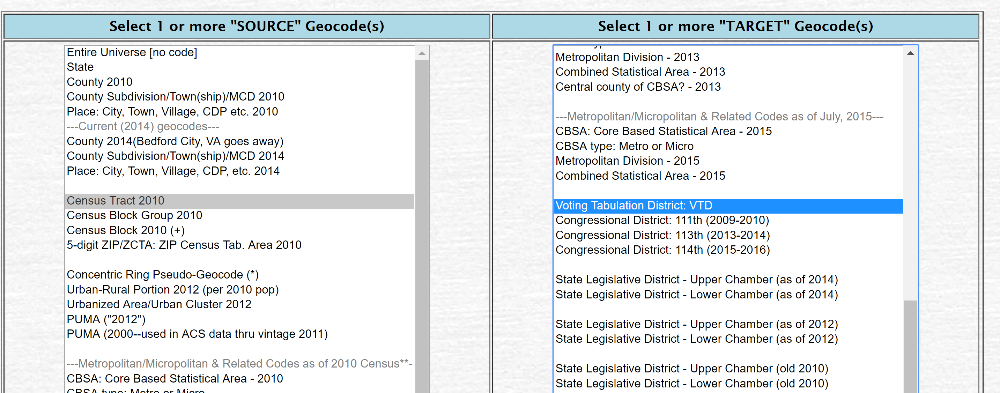

```{r setup, include=FALSE}

knitr::opts_chunk$set(echo = TRUE, warning=F, message=F, fig.width=8)

```


```{r, echo=F, eval=F}

# setwd( "C:/Users/jdlecy/Dropbox/04 - PAPERS/02 - Under Review/25 - Republican and Democratic Nonprofits/Data and Analysis" )


setwd( "D:/Dropbox/04 - PAPERS/03 - Published/18 - Republican and Democratic Nonprofits/Data and Analysis" )
```


# R Packages


```{r, eval=F}
install.packages( "rgdal" )
install.packages( "acs" )
install.packages( "censusapi" )
install.packages( "rgenoud" )
```


```{r}
library( rgdal )      # read GIS shapefiles
library( acs )        # get data from census
library( censusapi )  # get data from census
library( rgenoud )    # optimization
library( dplyr )      # data wrangling
library( stargazer )  # pretty tables
```


# Census Data

This example uses the **acs** package in R to download 2010 American Community Survey data from the US Census. 

You can find codes for variable names at the Census API site:

<https://api.census.gov/data/2010/acs/acs5/variables.html>


```{r, echo=F}
api.key.install( key="b431c35dad89e2863681311677d12581e8f24c24" )

my.censuskey <- "b431c35dad89e2863681311677d12581e8f24c24"
```


You will need to get a free Census API key: <https://api.census.gov/data/key_signup.html>

```{r, eval=F}
api.key.install( key="your_key_here" )

my.censuskey <- "your_key_here"
```


**NOTE**: This study uses the **acs** package but I would highly recommend using Hannah Recht's **censusapi** package. It is much easier to use!

For details on poverty measures see:

https://www.socialexplorer.com/data/ACS2013_5yr/metadata/?ds=ACS13_5yr&table=B17001


```{r, eval=T}

census <- getCensus( name="acs/acs5", 
                       vintage=2010, 
                       key=my.censuskey, 
                       vars=c( "NAME", 
                               "B01002A_001E",  # median age
                               "B19013_001E",   # median household income
                               "B01003_001E",   # total population"B01003_001"
                               "B17001_002E",   # poverty
                               "B17001_001E",   # population used for pov
                               "B03003_003E",   # hispanic
                               "B02001_002E",   # race.white
                               "B02001_003E"),  # race.black
                       region="tract:*", 
                       regionin="state:48")     # texas

names( census )

census$geoid <- paste0( census$state, census$county, census$tract )

names( census ) <- c("state","county","tract","NAME",
                     "medianage","income",
                     "totalpop","poverty","povbase",
                     "hispanic","white","black",
                     "geoid")

# Remove mission values
census$income[ census$income == -666666666 ] <- NA
census$medianage[ census$medianage == -666666666 ] <- NA
# Delete no population cases so rates are not infinite
census$totalpop[ census$totalpop == 0 ] <- NA
census$povbase[ census$povbase == 0 ] <- NA

census <- 
  census %>%
  mutate( poverty = round( 100*(poverty/povbase), 2),
          hispanic = round( 100*(hispanic/totalpop), 2),
          white = round( 100*(white/totalpop), 2),
          black = round( 100*(black/totalpop), 2) )
          
head( census )
```


```{r, results="asis"}
census %>%
  select( medianage, income, totalpop, poverty,
          hispanic, white, black ) %>% 
          stargazer( type = "html", digits=0 )
```


```{r, eval=F}
write.csv( census, "TexasCensusData2010.csv", rownames=F )
```


```{r, eval=F, echo=F}

census <- read.csv( "./Census Data/Texas Census Data.csv", colClasses="character" )

```


# Voting Districts Crosswalk

Voting districts and census tracts do not all share contiguous boundaries, so merging voting data and census data can be tricky. The Missouri Census Data Center has created tools that maps voting districts to census tracts using geographic apportionment. You can visit the MABLE Geocorr14 Geographic Correspondence Engine here:

<http://mcdc.missouri.edu/websas/geocorr14.html>

A correspondence table has been created by selecting the 2010 Census Tracts and Voting Tabulation Districts and is saved as the file "crosswalk.csv".

Note, the variable **pop10** comes from the crosswalk and refers to **voting district population**. The variable **totalpop** comes from the 2010 Census ACS and refers to the **census tract population**.



Since the relationships are not nested it will not be a one-to-one relationship, i.e. one voting district can match to multiple census tracts. As a result, we select the census tract for each voting district that has the highest apportionment rate (geographical overlap). 

The mean apportionment rate is 89% (standard deviation of 17%), with a median of 100% overlap. 


```{r, echo=F, eval=F}

setwd( "C:/Users/jdlecy/Dropbox/04 - PAPERS/02 - Under Review/25 - Republican and Democratic Nonprofits/Data and Analysis" )


```


```{r}
crosswalk <- read.csv( "crosswalk.csv", colClasses="character" )

head( crosswalk )

crosswalk <- crosswalk[ -1 , ] # drop first row of labels
```


### Create a crosswalk geoid

```{r}
crosswalk$tract.key <- paste( crosswalk$county, 
                              gsub( "\\.","", crosswalk$tract), sep="" )
head( crosswalk$tract.key )
```


### Add the crosswalk to census data

```{r}
census.dat <- merge( crosswalk, census, by.x="tract.key", by.y="geoid" )

head( census.dat )
```


# Voter Data

Data was obtained from the Harvard Election Data Archive project , a source for 2008 presidential election results at a voting district level for all 50 states. Texas contains 8,400 separate voting districts (VTDs). In the 2008 election of John McCain versus Barack Obama Texas had 1,451 Democratic supermajority districts and 2,886 Republican supermajority districts, representing 51% of all voting districts in the state.

http://projects.iq.harvard.edu/eda/

The data comes as a shapefile with historic voting data embedded, so we need to load the shapefile using the **rgdal** package in R and extract the historic voting data frame.

Select Data Dictionary:

* CNTY - County FIPS ID  
* VTD - Voting District ID  
* Shape_area - Area of voting district polygon 
* Pres_D_08 - Number of presidential votes for Democratic candidate in 2008
* Pres_R_08 - Number of presidential votes for Republican candidate in 2008


```{r, eval=T}
# library( rgdal )
TX <- readOGR(".","Texas_VTD" )
```

```{r}
par( mar=c(0,0,4,0) )
plot( TX, main="All Voting Districts in TX" )
```


### Convert spatial object to a dataframe

```{r}
tx <- as.data.frame( TX )
head( tx )
```


## Create Compatible IDs

The **vtdname** in the Census to VTD Crosswalk file, and the **vtdkey** in the Voting dataset are currently incompatible. 

The **vtdname** variables has four forms:

* 480190407  
* 48041010A, 48041010B, etc. 
* Vtng Dist 3111 
* Vtng Dist 03-3 

Each follows a format of:  SS-CCC-DIST

SS = state fips code (2 digits)
CCC = county fips code (3 digits)
DIST = voting district (4 characters)

```{r}
head( census.dat$vtdname, 50 )
```


To standardize:

```{r}

# Census Data

vtdnm <-  census.dat$vtdname

vtdnm <- gsub( "Vtng Dist ", "xxxxx", vtdnm )

head( vtdnm, 50 )
```


```{r}
# table( nchar( vtdnm ) )  # should all be 9 characters

vtd.temp <- substr( vtdnm, 6, 9 )
  
vtd.key1 <- paste0( census.dat$county.x, vtd.temp )

census.dat$vtd.key1 <- vtd.key1

head( census.dat$vtd.key1, 50 )
```


```{r}
# Voting Data

# TX state fips = 48

fips <- 48000 + as.numeric( as.character( tx$CNTY ) )

vtd.key2 <- paste0( fips, as.character( tx$VTD ) )

# table( nchar( vtd.key2 ) )  # should all be 9 characters
# vtd.key2[ nchar( vtd.key2 ) == 10 ]  # not sure about these 126

head( vtd.key2, 50 )
```


### Fields to Merge

* vtd.key2 - voter district id
* Pres_D_08 - votes cast for Obama in 2008
* Pres_R_08 - votes cast for McCain in 2008
* Shape_area - area of the voting district used for population density measures

```{r}
tx$vtd.key2 <- vtd.key2
tx <- tx[ , c( "vtd.key2", "Pres_D_08", "Pres_R_08", "Shape_area" ) ]
head( tx )
```


## Merge Voting and Census Data

```{r}
full.dat <- merge( census.dat, tx, by.x="vtd.key1", by.y="vtd.key2" )
head( full.dat )
write.csv( full.dat, "CensusPlusVotingAll.csv", row.names=F )
```


# Original Census Query (deprecated):

See `censusapi` package above for an easier method. For replication purposes the original code is included here:

```{r}

i <- "TX"


# median age  - "B01002A_001"
  
my.acs <- acs.fetch( endyear=2010, geo=geo.make( state=i, county="*", tract="*"), variable="B01002A_001" )
  
state <- substr( as.character( my.acs@geography$state + 100 ), 2, 3)
  
county <- substr( as.character( my.acs@geography$county + 1000 ), 2, 4)

tract <- substr( as.character( as.numeric(my.acs@geography$tract) + 1000000 ), 2, 7)

tract.id <- paste( state, county, tract, sep="" )

dat.age <- cbind( tract.id, age=my.acs@estimate[,"B01002A_001"] )


# hispanic - "B03003_003" 

my.acs <- acs.fetch( endyear=2010, 
                     geo=geo.make( state=i, county="*", tract="*"), 
                     variable="B03003_003" )

state <- substr( as.character( my.acs@geography$state + 100 ), 2, 3)

county <- substr( as.character( my.acs@geography$county + 1000 ), 2, 4)

tract <- substr( as.character( as.numeric(my.acs@geography$tract) + 1000000 ), 2, 7)

tract.id <- paste( state, county, tract, sep="" )

dat.hisp <- cbind( tract.id, hispanic=my.acs@estimate[,"B03003_003"] )


# poverty -  "B17001_001"  # baseline pop for which poverty is measured
# poverty -  "B17001_002"

my.acs <- acs.fetch( endyear=2010, 
                     geo=geo.make( state=i, county="*", tract="*"), 
                     variable="B17001_001" )

state <- substr( as.character( my.acs@geography$state + 100 ), 2, 3)

county <- substr( as.character( my.acs@geography$county + 1000 ), 2, 4)

tract <- substr( as.character( as.numeric(my.acs@geography$tract) + 1000000 ), 2, 7)

tract.id <- paste( state, county, tract, sep="" )

dat.pov1 <- cbind( tract.id, any.income=my.acs@estimate[,"B17001_001"] )

my.acs <- acs.fetch( endyear=2010, 
                     geo=geo.make( state=i, county="*", tract="*"), 
                     variable="B17001_002" )

state <- substr( as.character( my.acs@geography$state + 100 ), 2, 3)

county <- substr( as.character( my.acs@geography$county + 1000 ), 2, 4)

tract <- substr( as.character( as.numeric(my.acs@geography$tract) + 1000000 ), 2, 7)

tract.id <- paste( state, county, tract, sep="" )

dat.pov2 <- cbind( tract.id, inc.below=my.acs@estimate[,"B17001_002"] )

dat.pov <- merge( dat.pov1, dat.pov2 )

dat.pov$inc.below <- as.numeric( as.character( dat.pov$inc.below ) )
dat.pov$any.income <- as.numeric( as.character( dat.pov$any.income ) )
dat.pov$pov.rate <- dat.pov$inc.below / dat.pov$any.income
dat.pov$pov.rate[ dat.pov$any.income == 0 ] <- 0


# median household income - "B19013_001"

my.acs <- acs.fetch( endyear=2010, 
                     geo=geo.make( state=i,county="*", tract="*"), 
                     variable="B19013_001")

state <- substr( as.character( my.acs@geography$state + 100 ), 2, 3)

county <- substr( as.character( my.acs@geography$county + 1000 ), 2, 4)

tract <- substr( as.character( as.numeric(my.acs@geography$tract) + 1000000 ), 2, 7)

tract.id <- paste( state, county, tract, sep="" )

dat.inc <- cbind( tract.id, income=my.acs@estimate[,"B19013_001"] )


# race.white - "B02001_002"

my.acs <- acs.fetch( endyear=2010, 
                     geo=geo.make( state=i, county="*", tract="*"), 
                     variable="B02001_002" )

state <- substr( as.character( my.acs@geography$state + 100 ), 2, 3)

county <- substr( as.character( my.acs@geography$county + 1000 ), 2, 4)

tract <- substr( as.character( as.numeric(my.acs@geography$tract) + 1000000 ), 2, 7)

tract.id <- paste( state, county, tract, sep="" )

dat.race.white <- cbind( tract.id, white=my.acs@estimate[,"B02001_002"] )


# race.black - "B02001_003"

my.acs <- acs.fetch( endyear=2010, 
                     geo=geo.make( state=i, county="*", tract="*"), 
                     variable="B02001_003" )

state <- substr( as.character( my.acs@geography$state + 100 ), 2, 3)

county <- substr( as.character( my.acs@geography$county + 1000 ), 2, 4)

tract <- substr( as.character( as.numeric(my.acs@geography$tract) + 1000000 ), 2, 7)

tract.id <- paste( state, county, tract, sep="" )

dat.race.black <- cbind( tract.id, black=my.acs@estimate[,"B02001_003"] )


# total population - "B01003_001"

my.acs <- acs.fetch( endyear=2010, 
                     geo=geo.make( state=i, county="*", tract="*"), 
                     variable="B01003_001" )

state <- substr( as.character( my.acs@geography$state + 100 ), 2, 3)

county <- substr( as.character( my.acs@geography$county + 1000 ), 2, 4)

tract <- substr( as.character( as.numeric(my.acs@geography$tract) + 1000000 ), 2, 7)

tract.id <- paste( state, county, tract, sep="" )

dat.pop <- cbind( tract.id, totalpop=my.acs@estimate[,"B01003_001"] )

dat.pop <- as.data.frame( dat.pop )


  
dat.pop$tract.name <- rownames(dat.pop)

dat <- merge( dat.pop, dat.pov )
dat <- merge( dat, dat.race.white )
dat <- merge( dat, dat.race.black )
dat <- merge( dat, dat.inc )
dat <- merge( dat, dat.age )
dat <- merge( dat, dat.hisp )


dat$totalpop <- as.numeric( as.character( dat$totalpop ))
dat$white <- as.numeric( as.character( dat$white ))
dat$black <- as.numeric( as.character( dat$black ))
dat$hispanic <- as.numeric( as.character( dat$hispanic ))
dat$income <- as.numeric( as.character( dat$income ))
dat$age <- as.numeric( as.character( dat$age ))

dat$pov.rate <- round( 100*dat$pov.rate, 1 )
dat$white <- round( 100*(dat$white / dat$totalpop), 1 )
dat$black <- round( 100*(dat$black / dat$totalpop), 1 )
dat$hispanic <- round( 100*(dat$hispanic / dat$totalpop), 1 )

census2 <- dat[ c("tract.id","tract.name","totalpop","income",
                 "age","pov.rate","white","black","hispanic") ]

names( census2 ) <- c("geoid","geoname","totalpop","income",
                     "medianage","poverty","white","black","hispanic")

head( census2 )


# write.csv( census, "TexasCensusData2010.csv", rownames=F )

```


```{r, results="asis"}
census2$income[ census2$income == -666666666 ] <- NA
census2$medianage[ census2$medianage == -666666666 ] <- NA
census2$poverty[ census2$totalpop == 0 ] <- NA
census2$white[ census2$totalpop == 0 ] <- NA
census2$black[ census2$totalpop == 0 ] <- NA
census2$totalpop[ census2$totalpop == 0 ] <- NA

census2 %>%
  select( medianage, income, totalpop, poverty,
          hispanic, white, black ) %>% 
          stargazer( type = "html", digits=0 )
```


If you want to build a dataset from multiple states at once, you will need to use a loop because the Census API limits downloads at the tract level to one state at a time. It would look something like this:

```{r, eval=F}

### CREATE A LOOP TO GRAB DATA FOR ALL STATES AND STACK

dat.pov <- NULL # poverty rate

dat.inc <- NULL # median family income

dat.race.white <- NULL  # % white 

dat.race.black <- NULL  # % black

dat.pop <- NULL # total population


state.list <- c("AL","AK","AR","AZ","CA","CO","CT","DE","FL","GA","HI","ID","IL",
                "IN","IA","KS","KY","LA","MD","MA","ME","MI","MN","MS","MO","MT",
                "NE","NV","NH","NJ","NM","NY","NC","ND","OH","OK","OR","PA","RI",
                "SC","SD","TN","TX","UT","VT","VA","WA","WI","WV","WY")  


# hispanic:  "B01001I_001"
# median age:  "B01002A_001"

acs.fetch( endyear=2010, geo=geo.make( state="TX", county="*" ), variable="B17001_001" )
acs.fetch( endyear=2010, geo=geo.make( state="TX", county="*" ), variable="B01003_001" )


for( i in state.list )
{
  
  # i <- "AL"
  
  # poverty - please double-check to make sure "B17001_001" is correct
  
  my.acs <- acs.fetch( endyear=2010, 
                       geo=geo.make( state=i, county="*", tract="*"), 
                       variable="B17001_001" )
  
  state <- substr( as.character( my.acs@geography$state + 100 ), 2, 3)
  
  county <- substr( as.character( my.acs@geography$county + 1000 ), 2, 4)
  
  tract <- substr( as.character( as.numeric(my.acs@geography$tract) + 1000000 ), 2, 7)
  
  tract.id <- paste( state, county, tract, sep="" )
  
  temp.pov <- cbind( tract.id, poverty=my.acs@estimate[,"B17001_001"] )
  
  dat.pov <- rbind( dat.pov, temp.pov )
  
  
  # median household income
  
  my.acs <- acs.fetch( endyear=2010, 
                       geo=geo.make( state=i,county="*", tract="*"), 
                       variable="B19013_001")
  
  state <- substr( as.character( my.acs@geography$state + 100 ), 2, 3)
  
  county <- substr( as.character( my.acs@geography$county + 1000 ), 2, 4)
  
  tract <- substr( as.character( as.numeric(my.acs@geography$tract) + 1000000 ), 2, 7)
  
  tract.id <- paste( state, county, tract, sep="" )
  
  temp.inc <- cbind( tract.id, income=my.acs@estimate[,"B19013_001"] )
  
  dat.inc <- rbind( dat.inc, temp.inc )
  
  
  # race.white
  
  my.acs <- acs.fetch( endyear=2010, 
                       geo=geo.make( state=i, county="*", tract="*"), 
                       variable="B02001_002" )
  
  state <- substr( as.character( my.acs@geography$state + 100 ), 2, 3)
  
  county <- substr( as.character( my.acs@geography$county + 1000 ), 2, 4)
  
  tract <- substr( as.character( as.numeric(my.acs@geography$tract) + 1000000 ), 2, 7)
  
  tract.id <- paste( state, county, tract, sep="" )
  
  temp.race.white <- cbind( tract.id, white=my.acs@estimate[,"B02001_002"] )
  
  dat.race.white <- rbind( dat.race.white, temp.race.white )
  
  # race.black
  
  my.acs <- acs.fetch( endyear=2010, 
                       geo=geo.make( state=i, county="*", tract="*"), 
                       variable="B02001_003" )
  
  state <- substr( as.character( my.acs@geography$state + 100 ), 2, 3)
  
  county <- substr( as.character( my.acs@geography$county + 1000 ), 2, 4)
  
  tract <- substr( as.character( as.numeric(my.acs@geography$tract) + 1000000 ), 2, 7)
  
  tract.id <- paste( state, county, tract, sep="" )
  
  temp.race.black <- cbind( tract.id, black=my.acs@estimate[,"B02001_003"] )
  
  dat.race.black <- rbind( dat.race.black, temp.race.black )
  
  # total population 
  
  my.acs <- acs.fetch( endyear=2010, 
                       geo=geo.make( state=i, county="*", tract="*"), 
                       variable="B01003_001" )
  
  state <- substr( as.character( my.acs@geography$state + 100 ), 2, 3)
  
  county <- substr( as.character( my.acs@geography$county + 1000 ), 2, 4)
  
  tract <- substr( as.character( as.numeric(my.acs@geography$tract) + 1000000 ), 2, 7)
  
  tract.id <- paste( state, county, tract, sep="" )
  
  temp.pop <- cbind( tract.id, totalpop=my.acs@estimate[,"B01003_001"] )
  
  dat.pop <- rbind( dat.pop, temp.pop )	
  
}


dat <- merge( dat.pov, dat.inc )

dat <- merge( dat, dat.race.white )

dat <- merge( dat, dat.race.black )

dat <- merge( dat, dat.pop )


names( dat )
```


```{css, echo=F, eval=T}
p {
color: black;
margin: 0 0 20px 0;
}

td {
    padding: 3px 10px 3px 10px;
    text-align: center;
}

table
{ 
    margin-left: auto;
    margin-right: auto;
    margin-top:80px;
    margin-bottom:100px;
}

h1, h2{
  margin-top:100px;
  margin-bottom:20px;
}

H5{
    text-align: center;
    color: gray;
    font-size:0.8em;
}

img {
    max-width: 90%;
    display: block;
    margin-right: auto;
    margin-left: auto;
    margin-top:30px;
    margin-bottom:20px;
}


```


